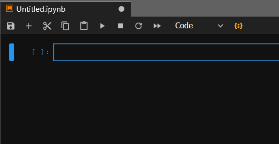

Jupyter Nim
====

This is a beta  [jupyter](http://jupyter.org/) kernel for nim written in nim. 
Works with `notebook` and `lab`, should also work in VSCode.
If you use `jupyter lab`, you can also install the companion extension for it by
```bash
jupyter labextension install jupyternim-labextension
```
to provide syntax highlighting.
  
Look at [example-notebook](examples/example-notebook.ipynb) for some examples.  

NOTE: running a notebook with this creates a directory `~/.jupyternim` in which it stores blocks of code, pngs, compiled outputs, etc.

Installation 
------------
TL,DR:
```
nimble install https://github.com/stisa/jupyternim -y
```
Done!

### Prereqs

- a working `nim` installation ( [download](http://nim-lang.org/download.html) )
- a working `jupyter` installation ( I recomend [miniconda3](http://conda.pydata.org/miniconda.html) and adding jupyter with `conda install jupyter` )
- a `zeromq` installation. Currently tested only with [ZeroMQ](http://zeromq.org/intro:get-the-software) 4.2. **It must be in PATH or the kernel won't run**.
### Long version:

The kernel should be automatically compiled and register by doing `nimble install jupyternim` ( or `nimble install https://github.com/stisa/jupyternim` if it's not in nimble yet).
  
Now you need to run `jupyternim` to register the kernel with jupyter (you can run `jupyternim` directly if you have `.nimble/bin` in your path, or run it from
`<nimblepath>/pkgs/jupyternim-####`). 


Alternatively, try the following:

- clone this repo: `git clone https://github.com/stisa/jupyternim`
- then go into the cloned dir `cd jupyternim`
- register to nimble with `nimble install`
- compile with `nimble build`
- run `jupyternim`to register the kernel
- run `jupyter notebook`

Note that [ZeroMQ](http://zeromq.org/intro:get-the-software) is dinamically linked, so it needs to be installed **and added to path**  

### HotCodeReloading
To enable the **very** experimental hotcodereloading support, you'll need to recompile `jupyternim` with `-d:useHcr` and then overwrite the one in `~/.nimble/pkgs/jupyternim-<version>` with it.  
The hotcodereloading mostly works, but there are various bugs that prevent its use. For examples, printing a float crashes it.

Editing
-------

`TAB` : completion request, for example `p<TAB` -> a pop up with possible completions  


TODO:
- [ ] `shift+TAB` : inspection request, for example `echo<shift+TAB>` -> a pop with a description of echo 
- [ ] support the debugger protocol, support variable value inspection

Magics:
-------

**passing flags**

`#>flags < --some > < --d:flag >`
Pass flags to nim compiler, default is `--verbosity:0 -d:release`.  
Passing new flags overwrites all other previous flags, even default ones.
Example: 
```nim
#>flags -d:test

echo "hi"
when defined test:
  echo "test defined"
else:
  echo "test not defined"
```
Outputs:
```
hi
test defined
```
TODO: provide a way to override default compilation output file

### Delete old temp files
`#>clear all`

### Displaying data
To send back data to display, you can use the module [jupyternimpkg/display](src/jupyternimpkg/display.nim), example:  

```nim
import nimPNG, jupyternimpkg/display

#needs absolute path (for now, PRs welcome)
let file = r"C:\\Users\stisa\\.nimble\\pkgs\\jupyternim-0.5.1\\jupyternimspec\\logo-64x64.png"
show dkPngFile, [64, 64]: # [width, height]
    file
```

If your file type is not supported by the `display` module yet, you need to implement the proc yourself.
Just write to stdout a string containing a json object defined as
```json
{   //<data> is base64 encoded for binary formats, eg png
    "data": {"<mimetype>": <data>}, 
    "metadata": {"<mimetype>": {<mimespecific>}},
    "transient": {}
}
```
enclosed in `#<jndd>#` and `#<outjndd>#` markers.
For example, to display a PNG image, simply:
```nim
import json, base64
var 
  img = readFile(path).encode # encode the png file with base64
  w = 320 # displayed width
  h = 240 # displayed height
var content: JsonNode = %*{
    "data": {"image/png": img }, 
    "metadata": %*{"image/png": {"width": w, "height":h}},
    "transient": %*{}
  }

echo "#<jndd>#" & $content $ "#<outjndd>#"
```
Consider sending a pr for the display module if you end up having to do this.

TODO
----
- [ ] Finish implementing messaging ( completion, introspection, history, update_display_data... )
- [ ] Connect to nimsuggest via socket, parse its output for introspection requests
- [ ] Documentation lookup magic? 
  - eg. put docs in a subfolder, then `#>doc sequtils` opens a browser to the correct `.html` page ( possibly local )  
- [ ] improve hotcodereloading (probably needs work on the compiler side)
- [ ] convince jupyter notebook maintainers to provide cellId, so I can stop patching the javascript
- [ ] find a better way to fake a repl than re running prior code and discarding output (we have HCR! Buggy though)
- [ ] use `JNsession` as name for temp files (allows multiple open kernels)
- [ ] a better way to handle `display_data` than string delimiters

General structure
-----------------

### [jupyternim](src/jupyternim.nim)
Handles init, start, stop of the various loops, as well as initial installation of the kernelspec. 

### [jupyternimpkg/messages](src/jupyternimpkg/messages.nim)
Handles message specifications exposing low level procs to decode, encode messages

### [jupyternimpkg/sockets](src/jupyternimpkg/sockets.nim)
Defines sockets types, how they are created, how their loops work, how they send and receive messages

### [jupyternimpkg/display](src/jupyternimpkg/display)
Handle preparing and sending back data to display

### [jupyternimspec](src/jupyternimspec/)
Logos for jupyter, a `kernel.js` file to load syntax highlight and patch jupyter notebook to send
a cellId.

Internal Notes
--------------
Messages must be multipart  
signature-must-be-lowercase  

http://nim-lang.org/docs/tinyc.html  

[Jupyter Kernel Docs](https://jupyter-client.readthedocs.io/en/latest/kernels.html#kernels)  
[IHaskell](http://andrew.gibiansky.com/blog/ipython/ipython-kernels)  
[Messaging Docs](https://jupyter-client.readthedocs.io/en/latest/messaging.html)  
[Async logger in nim](https://hookrace.net/blog/writing-an-async-logger-in-nim/)  
